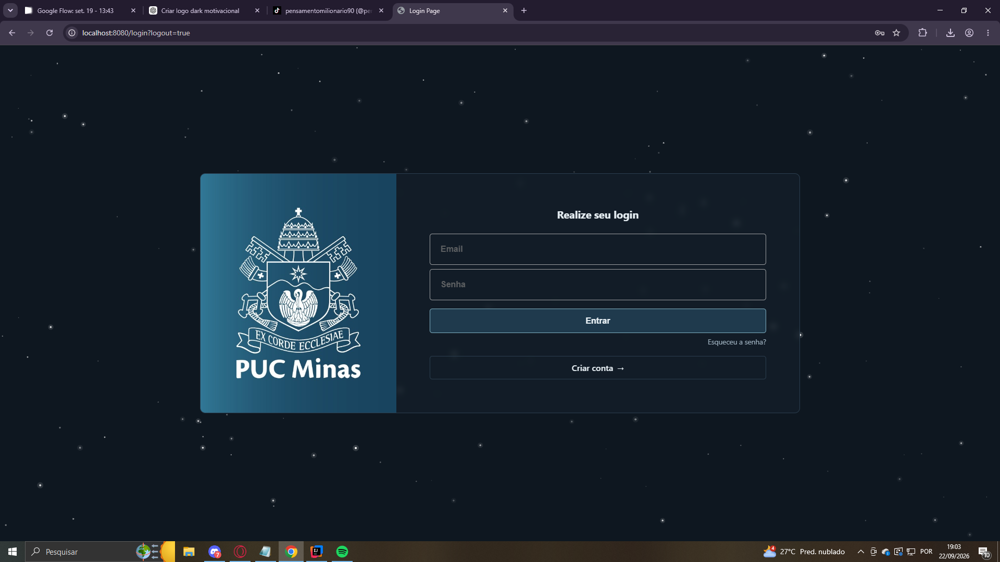
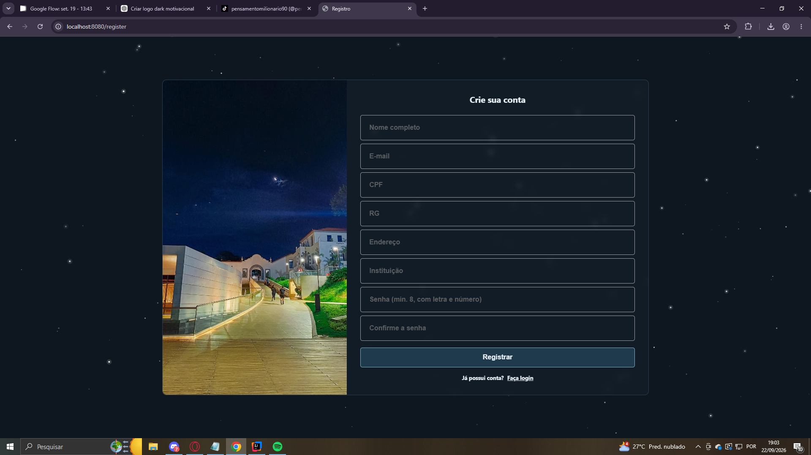
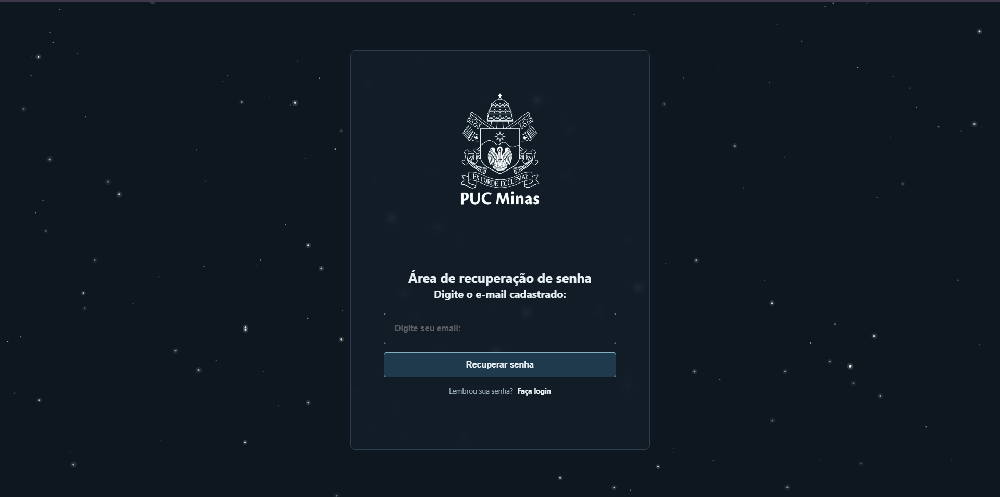

# Projeto SecureLoginPUC

## Descrição
O SecureLoginPUC é um projeto de aplicação web que implementa um sistema de login seguro utilizando Spring Boot e Spring Security. O objetivo é permitir a autenticação de usuários, diferenciando entre usuários comuns e administradores, e garantindo o acesso apropriado às páginas da aplicação.

## Estrutura do Projeto

```
LoginPUC
│
├── src
│   ├── main
│   │   ├── java
│   │   │   └── com.example.SecureLoginPUC
│   │   │       ├── application
│   │   │       │   └── SecureLoginPUCApplication.java
│   │   │       ├── config
│   │   │       │   ├── SecurityConfig.java
│   │   │       │   └── UserConfig.java
│   │   │       ├── controller
│   │   │       │   └── SecureLoginController.java
│   │   │       ├── exception
│   │   │       │   └── SendEmailException.java
│   │   │       ├── service
│   │   │       │   ├── PasswordResetService.java
│   │   │       │   ├── SendEmailService.java
│   │   │       │   └── UserService.java
│   │   │       └── validation
│   │   │           └── PasswordPolicy.java
│   │   │
│   │   └── resources
│   │       ├── application.properties
│   │       ├── static
│   │       │   ├── css
│   │       │   │   ├── login.css
│   │       │   │   ├── register.css
│   │       │   │   └── style.css
│   │       │   ├── images
│   │       │   │   ├── apc-login-bg.png
│   │       │   │   ├── apc-login-bg-2.png
│   │       │   │   ├── campus-fotoPUC.jpg
│   │       │   │   └── logoPUC.jpg
│   │       │   └── js
│   │       │       └── stars.js
│   │       └── templates
│   │           ├── admin.html
│   │           ├── error.html
│   │           ├── home.html
│   │           ├── login.html
│   │           ├── recoverpassword.html
│   │           ├── register.html
│   │           └── resetpassword.html
│   │
│   └── test
│       └── java
│           └── com.example.SecureLoginPUC
│               └── SecureLoginPUCApplicationTests.java             └── register.html

```

## Configuração do application.properties
Usuário e senha para que possa acessar o login:

```properties
spring.application.name=SecureLoginPUC
app.user.username=davidteste@gmail.com
app.user.password=7700
app.admin.username=admin
app.admin.password=1234
```

## Dependências
```xml
<!-- Dependência do Spring Boot Test -->
<dependency>
    <groupId>org.springframework.boot</groupId>
    <artifactId>spring-boot-starter-test</artifactId>
    <scope>test</scope>
</dependency>

<!-- Dependência do Spring Security -->
<dependency>
    <groupId>org.springframework.boot</groupId>
    <artifactId>spring-boot-starter-security</artifactId>
</dependency>

<!-- Dependência do Thymeleaf para o Spring Boot -->
<dependency>
    <groupId>org.springframework.boot</groupId>
    <artifactId>spring-boot-starter-thymeleaf</artifactId>
</dependency>

        <!-- Dependência do Spring Mail para o envio de email -->
<dependency>
    <groupId>org.springframework.boot</groupId>
    <artifactId>spring-boot-starter-mail</artifactId>
</dependency>
```

# Thymeleaf

Thymeleaf é um motor de templates para Java que permite a criação de páginas HTML dinâmicas de forma simples e eficiente. Ele é frequentemente utilizado em aplicações Spring, proporcionando uma maneira intuitiva de gerar conteúdo HTML e manipular dados diretamente nas páginas.

## Principais Características

- **Natural Templating**: Os templates Thymeleaf são válidos como documentos HTML, permitindo que sejam visualizados em navegadores sem processamento.
- **Integração com Spring**: Thymeleaf se integra perfeitamente com o Spring Framework, facilitando a injeção de dependências e o acesso a beans do Spring.
- **Expressões de Template**: Utiliza uma sintaxe simples e expressiva para manipular dados, permitindo a criação de lógicas condicionais e loops diretamente nas páginas.

## Exemplo de Uso

Aqui está um exemplo simples de um template Thymeleaf:

```html
<!DOCTYPE html>
<html xmlns:th="http://www.thymeleaf.org">
<head>
    <title>Exemplo Thymeleaf</title>
</head>
<body>
    <h1 th:text="${titulo}">Título do Documento</h1>
    <ul>
        <li th:each="item : ${itens}" th:text="${item}"></li>
    </ul>
</body>
</html>
```

Neste exemplo, o título e a lista de itens são preenchidos dinamicamente com dados fornecidos pelo controlador Spring.

Thymeleaf é uma escolha poderosa para desenvolvedores que desejam criar interfaces web dinâmicas e interativas em aplicações Java. Com sua sintaxe intuitiva e forte integração com o Spring, ele se tornou uma ferramenta popular no ecossistema de desenvolvimento Java.

# Interface Gráfica

A interface gráfica permite ao usuário inserir seus dados de login e, após a autenticação, ser redirecionado para a página correspondente, onde terá acesso às funcionalidades e informações de acordo com suas credenciais.

### Captura de Tela

- **Login**: A página de login possui campos para inserir o e-mail (ou usuário) e a senha. Ela também exibe o logo da PUC Minas, proporcionando uma identificação visual clara da instituição. Abaixo do formulário de login, existem links para os usuários que ainda não possuem cadastro, direcionando-os para a página de registro, e para aqueles que esqueceram a senha, levando-os à página de recuperação de senha.

- **Register**: A página de registro permite que novos usuários criem uma conta na plataforma. Ela inclui campos para inserir **nome completo, e-mail, CPF, RG, endereço, instituição, senha e confirmação de senha**, além de validar os dados informados (campos obrigatórios, formato do e-mail, senhas coincidentes, e-mail já cadastrado e requisitos mínimos de senha), garantindo que todas as informações necessárias para cadastro sejam coletadas corretamente. A lateral exibe o **logo da PUC Minas**, mantendo a identidade visual da instituição. Abaixo do formulário, há um link para os usuários que já possuem conta, direcionando-os de volta para a página de login.

- **Recuperação de senha**: Ao clicar em "Esqueceu a senha?" na tela de login, o usuário é levado à página de recuperação, onde informa seu e-mail cadastrado. Se o e-mail existir, um link de redefinição — válido por 30 minutos e de uso único — é enviado para a caixa de entrada. Ao acessá-lo, o usuário define uma nova senha e é redirecionado para o login.


|  |
|:---------------------------------------------------------------------------:|
|                               Página de Login                               |

|  |
|:---------------------------------------------------------------------------------:|
|                                Página de Registro                                 |

|  |
|:------------------------------------------------------------------------------------:|
|                            Página de Recuperação de Senha                            |


## Urls do projeto:
http://localhost:8080/login

http://localhost:8080/login?logout=true

http://localhost:8080/home

http://localhost:8080/admin

http://localhost:8080/error

http://localhost:8080/register

http://localhost:8080/recoverpassword
